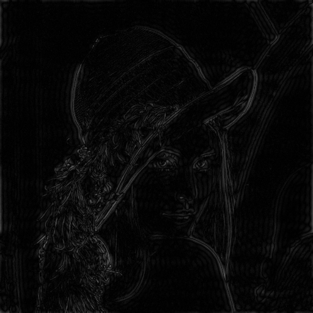

# Computer-Vision
This repository includes several computer vision tasks from ENGG5104 Image Processing and Computer Vision.

## Assignment 1 - Image Processing Basic:

Before Applying HPF        |  After Applying HPF
:-------------------------:|:-------------------------:
  |  

## Assignment 2 - Image Recognition:

## Assignment 3 - Local Feature Matching:

## Assignment 4 - Optical Flow Estimation:

## Final Project - Denoising Diffusion Model:
